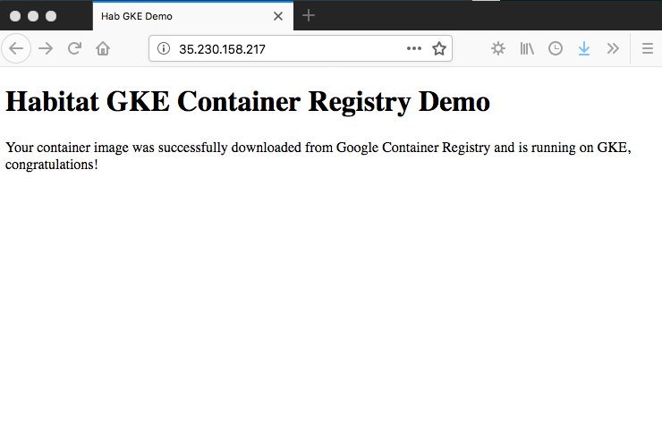

# Habitat package: hab-gcr-demo

## Description

This package includes nginx with a custom index page used to validate a simple deployment to GKE using Google Container Registry.

## Documentation

Below are the excerpts that will eventually be included in the Habitat documentation.


### Best Practices

#### Google Container Registry and Habitat

[Google Container Registry](https://cloud.google.com/container-registry/) is a private Docker repository that 
works with popular continuous delivery systems. It runs on GCP to provide consistent uptime on an infrastructure 
protected by Google's security. The registry service hosts your private images in Cloud Storage under your GCP project. 

Before you can push or pull images, you must configure Docker to use the gcloud command-line tool to authenticate 
requests to Container Registry. To do so, run the following command (you are only required to do this once):
```bash
$ gcloud auth configure-docker
```
Further access control information is [available here](https://cloud.google.com/container-registry/docs/access-control).

After a successful Habitat package build, images can be pushed to the Container Registry using the registry URI.  The format of this 
follows: `[HOSTNAME]/[PROJECT-ID]/[IMAGE]:[TAG]`, more details at [this link](https://cloud.google.com/container-registry/docs/pushing-and-pulling):

```bash
$ hab pkg export kubernetes ./results/habskp-hab-gcr-demo-0.1.0-20180710145742-x86_64-linux.hart
$ docker tag habskp/hab-gcr-demo:latest eu.gcr.io/spaterson-project/hab-gcr-demo:latests
$ docker push eu.gcr.io/spaterson-project/hab-gcr-demo:latest
```

#### Google Kubernetes Engine (GKE)

After images have been pushed to the Container Registry, they may be deployed to GKE in the same project without any further configuration changes.  To 
make images available publically or across projects, see [this documentation](https://cloud.google.com/container-registry/docs/access-control). 

Below is a sample manifest that deploys the Habitat managed container to GKE, pulling the image uploaded in the previous section 
from the Container Registry:

```
kind: Habitat
metadata:
  name: hab-gcr-demo
customVersion: v1beta2
spec:
  v1beta2:
    image: eu.gcr.io/spaterson-project/hab-gcr-demo:latest
    count: 1
    service:
      name: hab-gcr-demo
      topology: standalone
---
apiVersion: v1
kind: Service
metadata:
  name: hab-gcr-demo-lb
spec:
  type: LoadBalancer
  ports:
  - name: web
    port: 80
    targetPort: 8080
  selector:
    habitat-name: hab-gcr-demo
```

This also creates a Kubernetes load balancer service to expose port `8080` from the container to a public IP address on port `80`.

This example assumes [Habitat Operator](https://github.com/habitat-sh/habitat-operator) is running on the Kubernetes cluster but it 
is also possible to deploy using `kubectl` for Habitat packages exported as containers.


## Habitat Blog post

### Habitat GKE and GCR

This short post will explore how we can use Habitat and [Google Container Registry](https://cloud.google.com/container-registry/) to deploy a managed container to [Google Kubernetes Engine (GKE)](https://cloud.google.com/kubernetes-engine/) with [Habitat Operator](https://github.com/habitat-sh/habitat-operator) already installed.

The example we will be following is [here](https://github.com/chef-partners/hab-gcr-demo).  Checking this out reveals the following structure:
```bash
$ tree hab-gcr-demo
hab-gcr-demo
├── README.md
├── config
│   ├── index.html
│   └── nginx.conf
├── default.toml
├── deploy-hab-gcr-demo.yml
├── hooks
│   ├── init
│   └── run
└── plan.sh
```

From a Habitat perspective, the key lines of the `plan.sh` are as follows:
```
pkg_deps=(core/nginx)
pkg_exports=(
   [port]=http.server.port
)

do_build() {
  return 0
}

do_install() {
  return 0
```
This means we depend on the `core/nginx` maintained package and don't require any special build or installation setup.  This package will export a port which is important for us to see the `index.html` page when deployed at a later stage.  The configuration directory also includes a simple `nginx.conf` file. 

With Habitat installed locally, let's first trigger a build:
```
$ cd hab-gcr-demo/
$ hab pkg build .
   hab-studio: Creating Studio at /hab/studios/src (default)
   ...   
```
This will create a `hart` file in the `results` folder according to the origin and package name e.g.
```
$ ls results/
habskp-hab-gcr-demo-0.1.0-20180711153450-x86_64-linux.hart	logs
last_build.env
```
From the studio or otherwise, now execute the following to create a container image.  This is what we will upload to Google Container Registry.

```
$ hab pkg export kubernetes results/habskp-hab-gcr-demo-0.1.0-20180711153450-x86_64-linux.hart
```

This creates a docker image with tags e.g.
```
$ docker images
REPOSITORY                                  TAG                     IMAGE ID            CREATED             SIZE
habskp/hab-gcr-demo                         0.1.0                   ed2580b52a3a        53 seconds ago      271MB
habskp/hab-gcr-demo                         0.1.0-20180711153450    ed2580b52a3a        53 seconds ago      271MB
habskp/hab-gcr-demo                         latest                  ed2580b52a3a        53 seconds ago      271MB
```
The following command ensures we are authorized to push/pull images to Container Registry:
```
$ gcloud auth configure-docker
```
Now we run the following two commands to tag and push our image, note that the repository URI conforms to `[HOSTNAME]/[PROJECT-ID]/[IMAGE]:[TAG]`, more details [here](https://cloud.google.com/container-registry/docs/pushing-and-pulling):

```
$ docker tag habskp/hab-gcr-demo:latest eu.gcr.io/spaterson-project/hab-gcr-demo:latest
$ docker push eu.gcr.io/spaterson-project/hab-gcr-demo:latest
The push refers to repository [eu.gcr.io/spaterson-project/hab-gcr-demo]
567f6430b59f: Pushed 
latest: digest: sha256:a9db7cc0cf186311eddde7d5f796b998b6aad5521d435ffa63ee572d0fb1d73a size: 529
```
With our image in the Container Registry we can deploy the application to Google Kubernetes Engine using the provided manifest:

```
$ cat deploy-hab-gcr-demo.yml 
apiVersion: habitat.sh/v1beta1
kind: Habitat
metadata:
  name: hab-gcr-demo
customVersion: v1beta2
spec:
  v1beta2:
    image: eu.gcr.io/spaterson-project/hab-gcr-demo:latest
    count: 1
    service:
      name: hab-gcr-demo
      topology: standalone
---
apiVersion: v1
kind: Service
metadata:
  name: hab-gcr-demo-lb
spec:
  type: LoadBalancer
  ports:
  - name: web
    port: 80
    targetPort: 8080
  selector:
    habitat-name: hab-gcr-demo
```

This also creates a Kubernetes LoadBalancer to expose port `8080` from the container running nginx to a public IP address on port `80`.  This manifest can now be deployed to GKE:

```
$ kubectl apply -f deploy-hab-gcr-demo.yml 
habitat "hab-gcr-demo" created
service "hab-gcr-demo-lb" created
$ kubectl get services hab-gcr-demo-lb
NAME              TYPE           CLUSTER-IP     EXTERNAL-IP      PORT(S)        AGE
hab-gcr-demo-lb   LoadBalancer   10.451.200.92   35.233.155.217   80:31696/TCP   1m
```

Navigating to the page we see the expected `index.html`:



Watch this space, Habitat Builder integration for Google Container Registry is coming soon.  Thanks for reading! 